# 🛒 ProdAlert

Sistema desenvolvido com o objetivo de **reduzir o desperdício de alimentos** por meio do **controle de validade de produtos perecíveis**. O projeto visa conscientizar comerciantes sobre a importância de um bom gerenciamento de estoque, reduzindo prejuízos financeiros e impactos ambientais.

---

## 🌱 Visão Geral

Com o **ProdAlert**, empresas conseguem:

- Cadastrar produtos com data de validade e quantidade.
- Visualizar rapidamente os últimos produtos cadastrados.
- Buscar produtos por nome, código de barras e período de validade.
- Gerar relatórios sobre os cadastros tando em **PDF** quanto em **Excel**.
- Inativar e vincular funcionários a empresas.
- Alertas diários via e-mail sobre produtos com validades próximas. 

---

## 🚀 Tecnologias Utilizadas

| Camada         | Tecnologia                             |
|----------------|----------------------------------------|
| Back-end       | Spring Boot, Java 17                   |
| Segurança      | Spring Security, JWT                   |
| Banco de Dados | MySQL                                  |
| Front-end      | HTML, CSS, JavaScript                  |
| Exportação     | Apache POI (XLSX), iText (PDF)         |

---

## 💡 Desafios Enfrentados

- Implementar um sistema de autenticação com **cadastro de usuários físicos e jurídicos**, validação via e-mail.
- Criar lógica de **vinculação entre funcionários e empresas**, com controle de status ativo/inativo dos usuários.
- Gerar relatórios personalizados contendo os dados do usuário e da empresa.
- Validação de tokens temporários para redefinição de senha e confirmação de e-mail.
- Validação de tokens para o uso da aplicação em um tempo limite diário. 
- Exibir mensagens claras e objetivas para o usuário final, mantendo uma interface simples.

---

## 📚 Diagrama de Classes

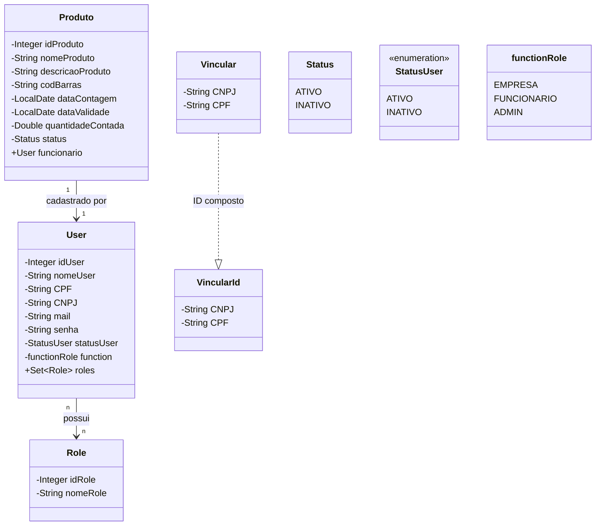
#
## 🏠Tela Inicial

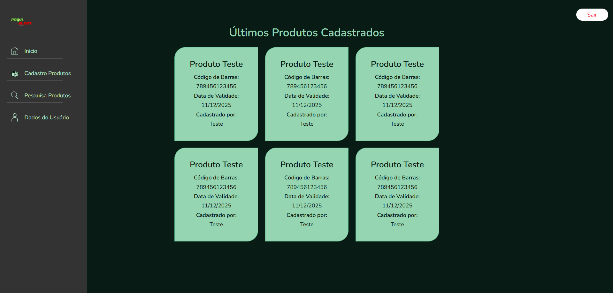 

Ao acessar o sistema, o usuário é apresentado a esta tela inicial, que exibe os 6 últimos produtos cadastrados. O objetivo é fornecer uma visão rápida da atividade de cadastro mais recente.

Para cada produto cadastrado, são exibidas as seguintes informações em um card individual:

* **Nome do Produto:** O nome do produto cadastrado.
* **Código de Barras:** O código de barras do produto.
* **Data de Validade:** A data de validade do produto.
* **Cadastrado por:** O nome do usuário (funcionário) responsável pelo cadastro deste produto.

É importante notar que esta listagem inclui os produtos cadastrados por todos os funcionários da empresa.
#
## 🔐Tela de Login

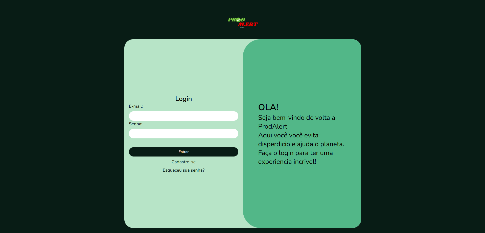 

Esta é a tela inicial para acessar o sistema ProdAlert. Para fazer login, o usuário deve preencher os seguintes campos:

* **E-mail:** O endereço de e-mail cadastrado.
* **Senha:** A senha correspondente à conta de e-mail.

Após preencher os campos, o usuário deve clicar no botão "**Entrar**" para acessar o sistema.

Abaixo do botão de login, existem links para:

* **Cadastre-se:** Redireciona para a tela de cadastro de novos usuários.
* **Esqueceu sua senha?:** Inicia o processo de recuperação de senha, que deve ser informado o e-mail, para que possa ser encaminhado um codigo de 6 digitos para ele com um tempo de expiração, e apos isso é redirecionado a pagina para que possa informar o codigo recebido.

À direita da tela de login, há uma mensagem de boas-vindas:

> OLA! Seja bem-vindo de volta a ProdAlert. Aqui você evita desperdício e ajuda o planeta. Faça o login para ter uma experiência incrível!
#
## 📝Tela de Cadastro

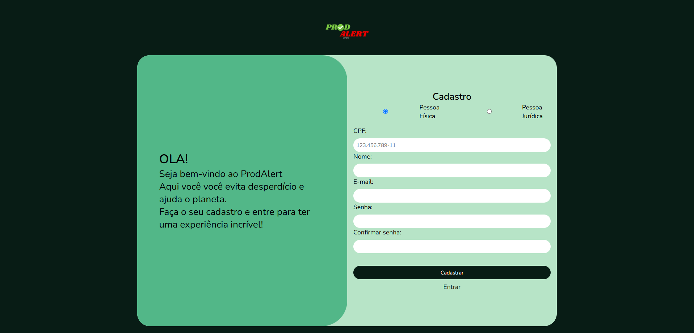 

Esta tela permite que novos usuários se cadastrem no sistema ProdAlert. O usuário pode escolher entre cadastrar-se como Pessoa Física ou Pessoa Jurídica através de botões de rádio.

**Cadastro de Pessoa Física:**

* **CPF:** Cadastro de Pessoa Física.
* **Nome:** Nome completo do usuário.
* **E-mail:** Endereço de e-mail para a nova conta.
* **Senha:** Senha desejada para a nova conta.
* **Confirmar senha:** Confirmação da senha digitada.

**Cadastro de Pessoa Jurídica:**

* **CNPJ:** Cadastro Nacional de Pessoas Jurídicas.
* **Razão Social:** Razão Social ou o nome fantasia.
* **E-mail:** Endereço de e-mail para a nova conta.
* **Senha:** Senha desejada para a nova conta.
* **Confirmar senha:** Confirmação da senha digitada.

Após preencher todos os campos obrigatórios, o usuário deve clicar no botão "**Cadastrar**" para criar sua conta, apos isso o mesmo é redirecionado a uma pagina de confirmação de e-mail, onde deve informar um codigo de 6 digitos que recebeu via e-mail. 
Há também um botão "**Entrar**" que redireciona para a tela de login.

À esquerda da tela de cadastro, a mesma mensagem de boas-vindas da tela de login é exibida:

> OLA! Seja bem-vindo ao ProdAlert. Faça o seu cadastro e entre para ter uma experiência incrível!
#
## ➕Cadastro de Produto

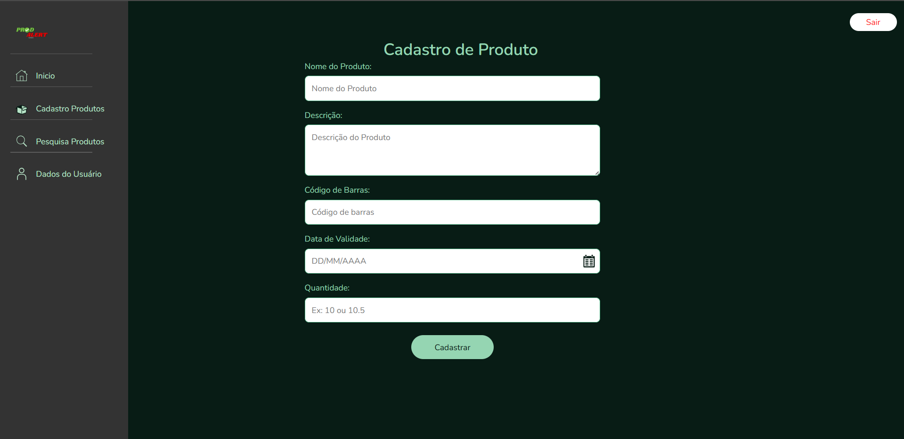 

Esta tela permite que funcionários vinculados a uma empresa cadastrem novos produtos no sistema. Para realizar o cadastro, o usuário deve preencher os seguintes campos:

* **Nome do Produto:** O nome do item a ser cadastrado.
* **Descrição do Produto:** Uma descrição detalhada do produto.
* **Código de Barras:** O código de barras único do produto.
* **Data de Validade:** A data de validade do lote de produtos.
* **Quantidade:** A quantidade deste produto específico (com o mesmo código de barras e data de validade).

Todos os campos são obrigatórios para o cadastro ser realizado com sucesso.
#
## 🔎Pesquisa de Produtos

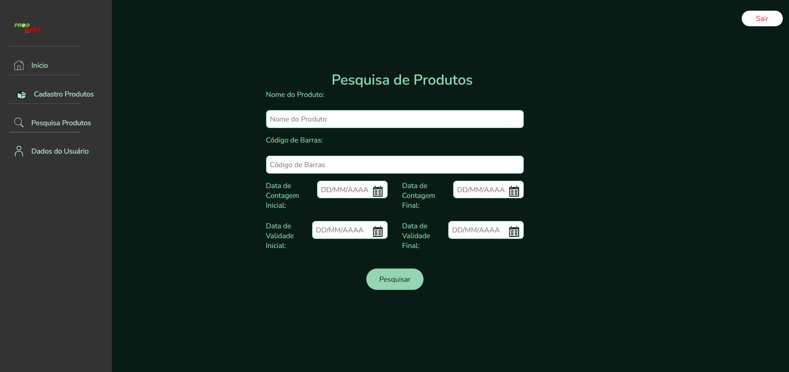 

Esta tela oferece diversas opções para buscar produtos cadastrados no sistema. Não é obrigatório preencher todos os campos; a pesquisa pode ser realizada utilizando diferentes combinações de critérios:

* **Nome do Produto:** Permite buscar produtos por parte ou nome completo.
* **Código de Barras:** Permite buscar um produto específico através do seu código de barras.
* **Data de Contagem (Inicial e Final):** Permite buscar produtos dentro de um intervalo de datas de lançamento (cadastro).
* **Data de Validade (Inicial e Final):** Permite buscar produtos dentro de um intervalo de datas de validade.

É possível combinar o nome do produto com os intervalos de data de contagem ou validade.

**Comportamento padrão:** Caso nenhum campo de pesquisa seja preenchido e o botão "Pesquisar" seja acionado, o sistema retornará todos os produtos cadastrados pelos funcionários da empresa que ainda não estão vencidos.
#
## 📊Resultado da Pesquisa de Produtos

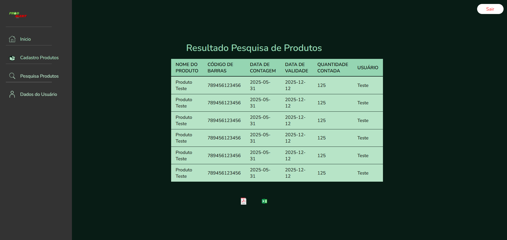 

Após realizar a pesquisa, os resultados são exibidos nesta tela em formato de tabela. Cada linha representa um produto que corresponde aos critérios de busca. As seguintes informações são apresentadas por produto:

* **Nome do Produto:** O nome do produto.
* **Código de Barras:** O código de barras do produto.
* **Data de Contagem:** A data em que o produto foi cadastrado no sistema.
* **Data de Validade:** A data de validade do produto.
* **Quantidade Contada:** A quantidade registrada deste produto.
* **Usuário:** O nome do usuário que cadastrou o produto.

**Exportação de Dados:**

Nesta página, também é possível exportar os dados da tabela para os formatos PDF e XLSX. Ao exportar, o relatório incluirá uma coluna adicional com a **Descrição do Produto**, além dos campos já exibidos na tela. O cabeçalho do relatório conterá informações sobre o usuário que o gerou, a empresa à qual pertence (se aplicável), e a data e hora da emissão.
#
## 👤Dados do Usuário

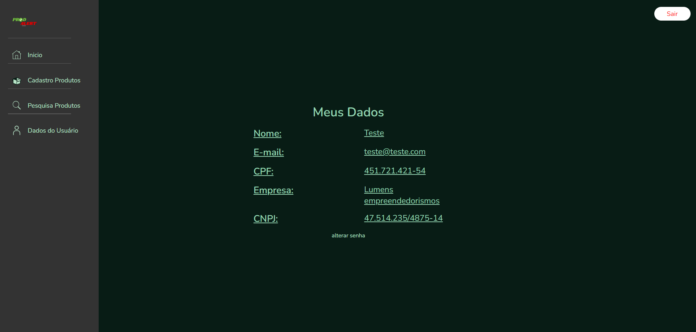 

Esta seção exibe as informações do usuário logado. O conteúdo apresentado varia de acordo com o tipo de usuário:

* **Funcionários:** Visualizam seu Nome, E-mail, CPF, a Empresa à qual estão vinculados e o CNPJ dessa empresa. Caso o funcionário não esteja vinculado a nenhuma empresa, os campos de Empresa e CNPJ não são exibidos.
* **Empresas:** Visualizam o Nome da Empresa, o CNPJ e o E-mail cadastrado.

Nesta tela, o usuário tem a opção de alterar sua senha através do link "alterar senha" caso ele tenha esquecido.
#
## 🛑Inativar Funcionário (Passo 1: Busca por CPF)

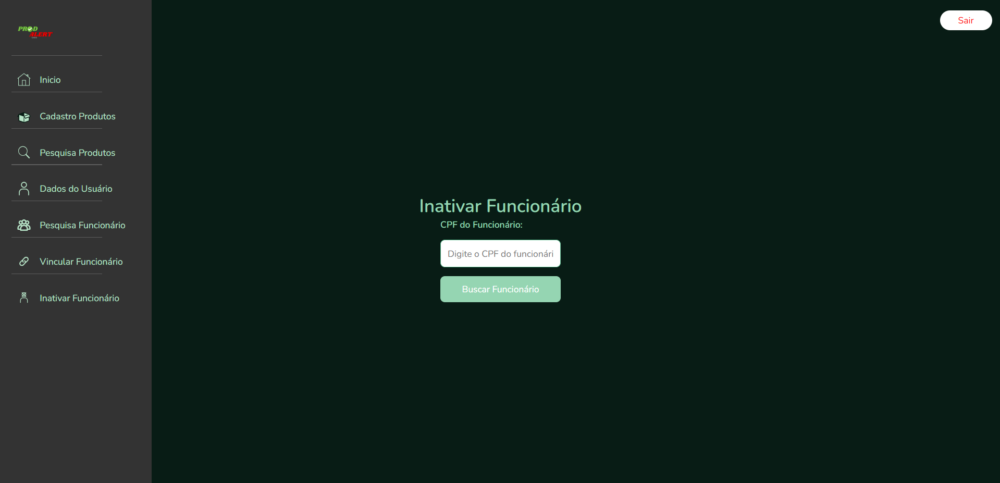 

Nesta tela, usuários com a role de EMPRESA podem iniciar o processo de inativação de um funcionário vinculado à sua empresa. Para isso, é necessário inserir o CPF do funcionário que se deseja inativar no campo "**CPF do Funcionário**" e clicar em "**Buscar Funcionário**".
#
## 🛑Inativar Funcionário (Passo 2: Confirmação de Inativação)

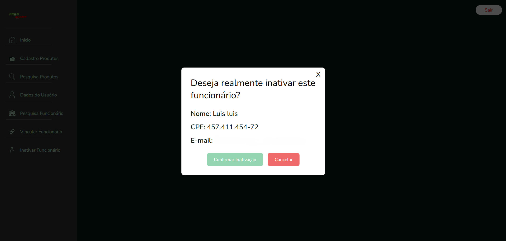 

Após a busca pelo CPF, esta janela de confirmação é exibida, perguntando ao usuário EMPRESA se ele realmente deseja inativar o funcionário. As seguintes informações do funcionário a ser inativado são apresentadas:

* **Nome:** O nome do funcionário.
* **CPF:** O CPF do funcionário.
* **E-mail:** O e-mail do funcionário.

O usuário tem duas opções: "**Confirmar Inativação**" para prosseguir com a inativação ou "**Cancelar**" para interromper o processo.
Caso ele selecione a opção de Confirmar o usuário é inativado e o mesmo é informado pelo e-mail do qual ele foi cadastrado. 
Para reativar um funcionario que esteja com status inativo deve ser feito um novo vinculo com outra empresa, porem é informado para a empresa que o funcionario esta com status inativo.
#
## 🔗Vincular Funcionário (Passo 1: Busca por CPF)

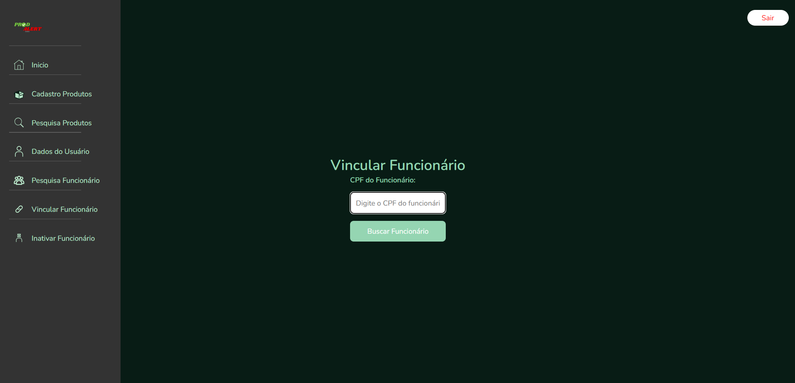 

Nesta tela, usuários com a role de EMPRESA podem buscar um funcionário (previamente cadastrado no sistema) para vincular à sua empresa. Para iniciar o processo, é necessário inserir o CPF do funcionário no campo "**CPF do Funcionário**" e clicar em "**Buscar Funcionário**".
#
## 🔗Vincular Funcionário (Passo 2: Ativar e Vincular Funcionário Inativo)

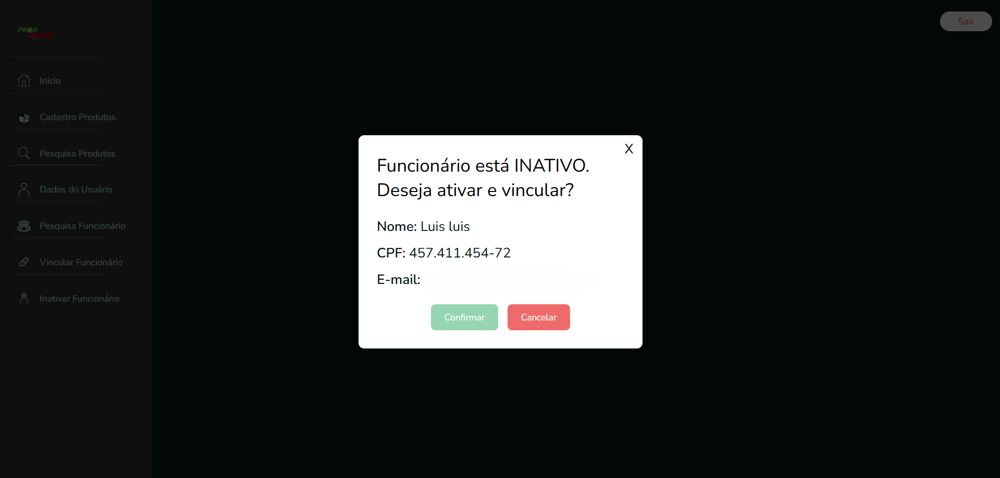 

Após a busca por um CPF, caso o funcionário esteja inativo, esta janela será exibida. Ela informa "**Funcionário está INATIVO. Deseja ativar e vincular?**" e apresenta as seguintes informações do funcionário encontrado:

* **Nome:** O nome do funcionário.
* **CPF:** O CPF do funcionário.
* **E-mail:** O e-mail do funcionário.

O usuário tem duas opções: "**Confirmar**" para ativar o usuário FUNCIONARIO e vincular à sua empresa, ou "**Cancelar**" para interromper o processo.
Caso o usuário com ROLE EMPRESA pressione confirmar para vincular o funcionário a sua empresa o funcionario recebe um e-mail informativo que ele foi vinculado a uma nova empresa.
#
## 🔎Pesquisa de Usuários

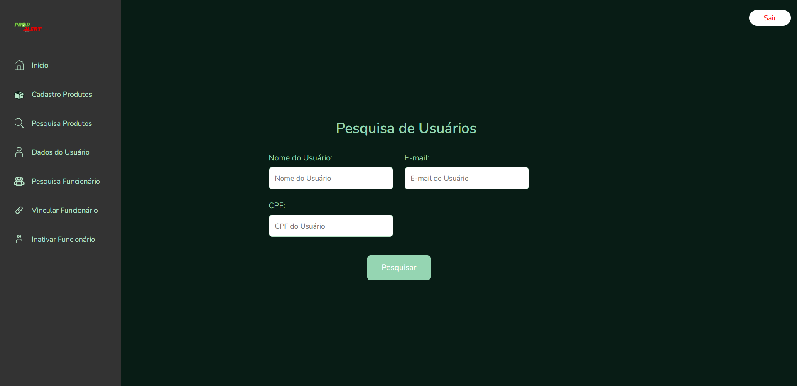 

Esta tela permite que usuários com role de EMPRESA pesquisem outros usuários (funcionários) cadastrados no sistema que estão vinculados ao seu CNPJ. A pesquisa pode ser realizada preenchendo um ou mais dos seguintes campos:

* **Nome do Usuário:** Permite buscar usuários por nome.
* **E-mail:** Permite buscar usuários por endereço de e-mail.
* **CPF:** Permite buscar usuários pelo Cadastro de Pessoa Física.

Após preencher os critérios desejados, clique no botão "**Pesquisar**" para exibir os resultados.
#
## 📊Resultado da Pesquisa de Usuários

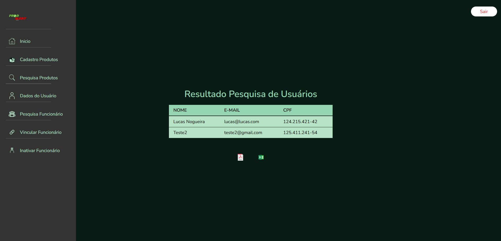 

Após realizar a pesquisa, os resultados são exibidos nesta tela em formato de tabela. Cada linha representa um usuário que corresponde aos critérios de busca. As seguintes informações são apresentadas para cada usuário encontrado:

* **Nome:** O nome do usuário.
* **E-mail:** O endereço de e-mail do usuário.
* **CPF:** O CPF do usuário.

Similar à pesquisa de produtos, nesta página também é possível exportar os dados da tabela para os formatos PDF e XLSX.

## 🧑‍💻 Autor

**Luis Fernando Felix Nogueira**  
Técnico em Eletrotécnica e graduando em Análise e Desenvolvimento de Sistemas.  
Desenvolvedor do projeto **ProdAlert**.  
[LinkedIn](https://www.linkedin.com/in/lu%C3%ADs-fernando-felix-nogueira-734154288/) | [GitHub](https://github.com/lumens7)

## 📄 Licença

Este projeto está licenciado sob os termos da **Licença MIT** – veja o arquivo [LICENSE](./LICENSE) para detalhes.

