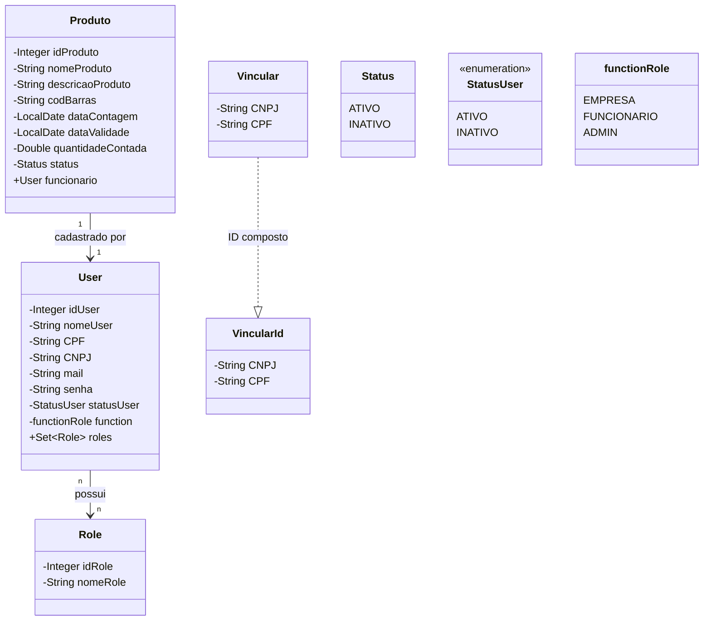

# ProdAlert
Projeto que visa ajudar comerciantes a importância do controle de estoque, e o pq de não desperdiçar alimentos pela causa ambiental.

```mermaid
classDiagram
    direction TB

    class Produto {
        -Integer idProduto
        -String nomeProduto
        -String descricaoProduto
        -String codBarras
        -LocalDate dataContagem
        -LocalDate dataValidade
        -Double quantidadeContada
        -Status status
        +User funcionario
    }

    class User {
        -Integer idUser
        -String nomeUser
        -String CPF
        -String CNPJ
        -String mail
        -String senha
        -StatusUser statusUser
        -functionRole function
        +Set~Role~ roles
    }

    class Role {
        -Integer idRole
        -String nomeRole
    }

    class Vincular {
        -String CNPJ
        -String CPF
    }

    class VincularId {
        -String CNPJ
        -String CPF
    }

    class Status {
        ATIVO
        INATIVO
    }

    class StatusUser {
        <<enumeration>> 
        ATIVO
        INATIVO
    }

    class functionRole {
        EMPRESA
        FUNCIONARIO
        ADMIN
    }

    Produto "1" --> "1" User : cadastrado por
    User "n" --> "n" Role : possui
    Vincular ..|> VincularId : ID composto
```
